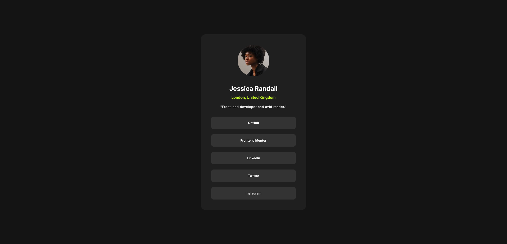

# Frontend Mentor - Social links profile solution

This is a solution to the [Social links profile challenge on Frontend Mentor](https://www.frontendmentor.io/challenges/social-links-profile-UG32l9m6dQ). Frontend Mentor challenges help you improve your coding skills by building realistic projects. 

## Table of contents
- [Overview](#overview)
  - [The challenge](#the-challenge)
  - [Screenshot](#screenshot)
  - [Links](#links)
- [My process](#my-process)
  - [Built with](#built-with)
  - [Continued development](#continued-development)
- [Author](#author)

**Note: Delete this note and update the table of contents based on what sections you keep.**

## Overview

### The challenge

Users should be able to:

- See hover and focus states for all interactive elements on the page

### Screenshot

### Links

- Live Site URL: https://ejmk18.github.io/FEM-social-links-challenge/

## My process

### Built with

- Semantic HTML5 markup
- CSS custom properties
- Flexbox
- CSS Grid

### Continued development

I aim to grasp a comprehensive understanding of the fundamental elements of web development. By trying to complete challenges based on HTML and CSS best practices, I can obtain my goal. Currently, I am learning JavaScript as well, which I am not extremely comfortable with yet. However, with discipline and practice, I am sure that I will be capable of understanding the fundamental elements of web development.

## Author

- Frontend Mentor - https://www.frontendmentor.io/profile/EJMK18
